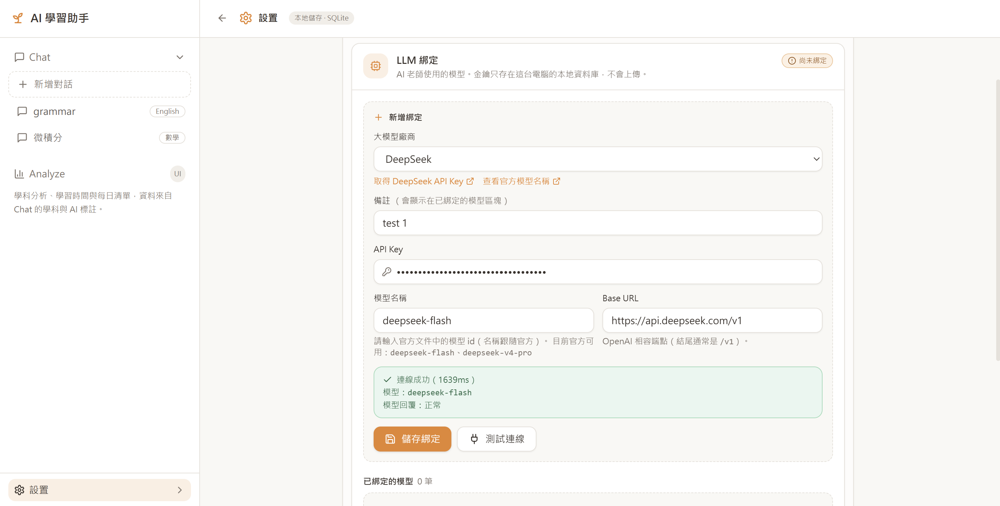
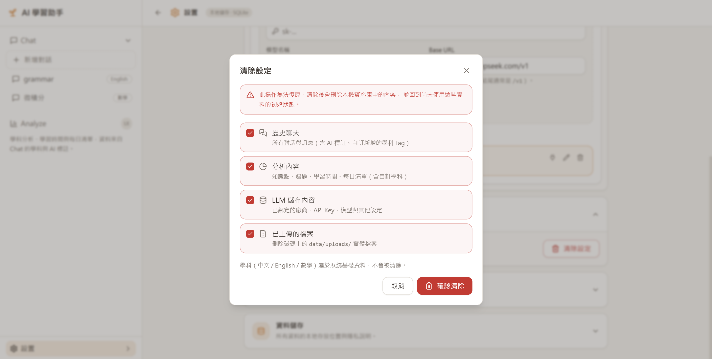
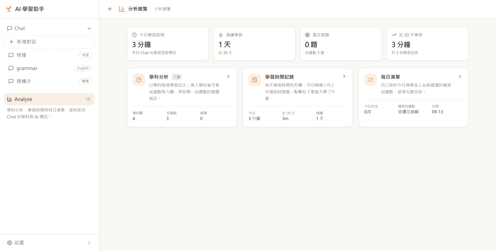
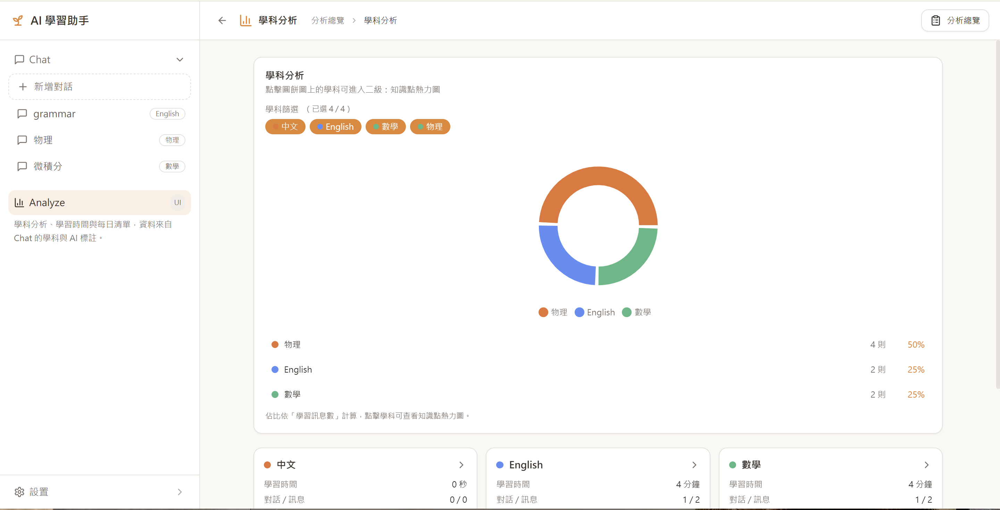
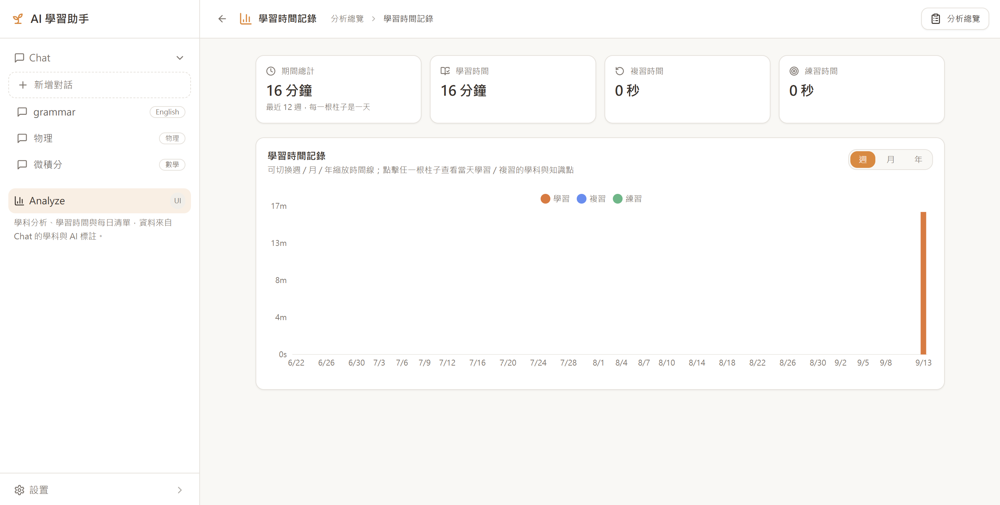

# AI-Learn-Assist

結合AI教師+學習分析的工具|An AI-powered learning assistant that combines a 
分析用戶的學科表現，學習表情，學習輔助的工具|chatbot with the ability to analyze your subject performance, track study progress, and assist your learning — all in one tool.

平台目前使用繁體中文顯示，其餘版本後續補充。
The platform currently uses **Traditional Chinese** for its interface. Other language versions will be added later.

除了LLM需要綁定大模型雲端api，其餘功能皆為本地運行。以下是使用說明，該以下是繁體中文的版本，簡體中文和英文版本請選擇下面入口
**Except for the LLM, which requires binding to a cloud-based model API, all other features run locally.**

---

[簡體中文](README.zh-CN.md) | [English](README.md)

---

## 使用說明

### 1. 學科綁定

一個窗口綁定一個學科，這將會影響該窗口的學習分析數據。

---

### 2. 聊天功能

可上傳文件，對話氣泡皆可顯示 Markdown 格式的效果。

---

### 3. AI LLM 綁定

於漢堡下方的設置進入。第一個是 LLM 綁定，支援多種大模型品牌，或者自行輸入 Base URL 綁定，需要相容 OpenAI。（綁定後可刪除）

亦可一鍵清除儲存的所有變更。

---

### 4. 分析

包括學科分析、學習時間記錄、每日清單。（更多內容之後再更新）

#### 4.1 學科分析

根據 Chat 中學習過的學科，以 Pie 圖展示學習情況。

點擊 Pie 圖中具體學科，進入該學科的知識點熱力圖，可統計該知識點的掌握狀態。

點擊具體知識點，可進入查看該知識點的具體錯題統計。

#### 4.2 學習時間統計

可縮放時間線。

#### 4.3 每日學習清單

提醒自己學習。

---

## 備註

- 平台介面目前為繁體中文
- 除 LLM 需綁定雲端 API 外，其餘功能皆為本地運行