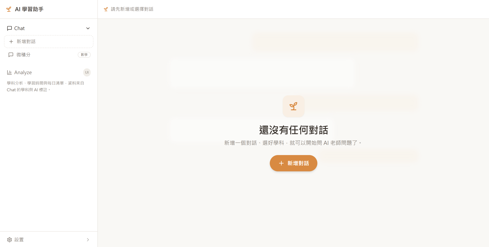
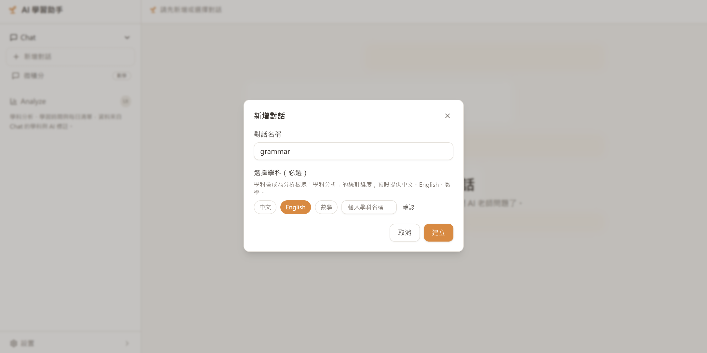
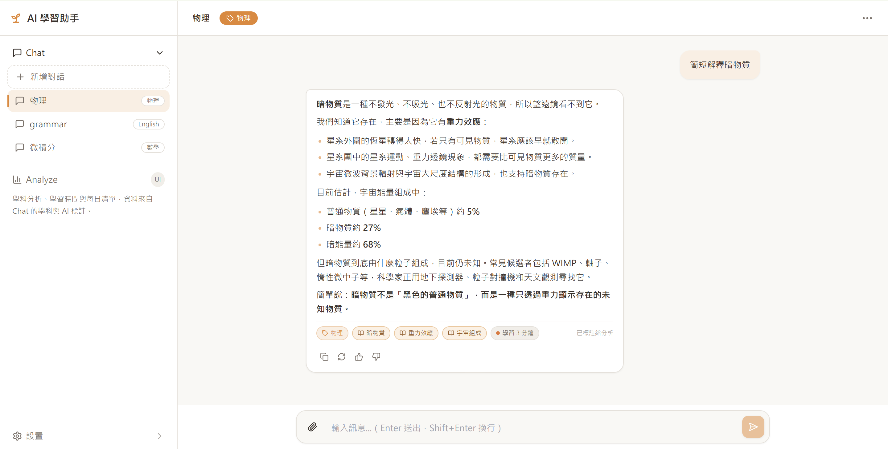
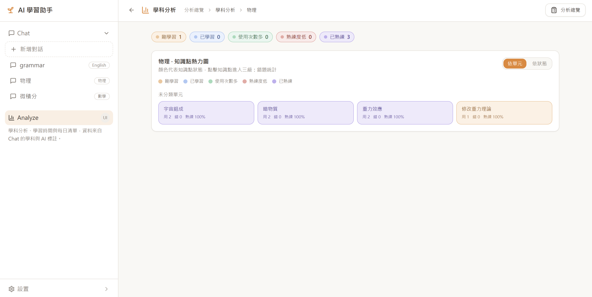
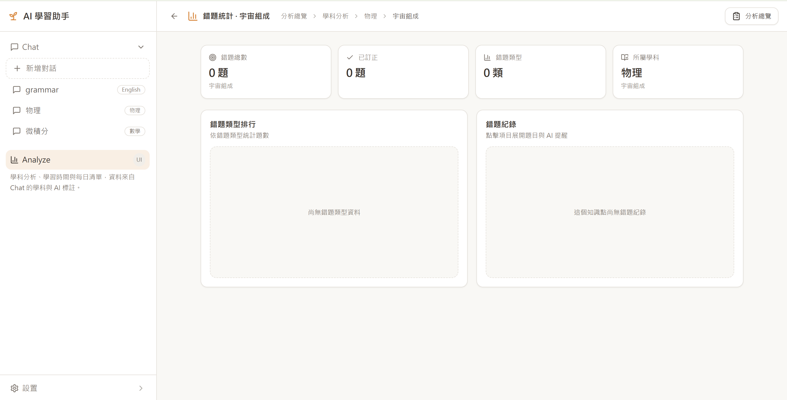
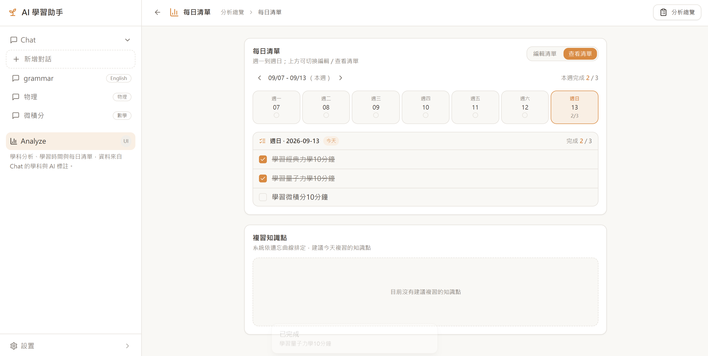

# AI-Learn-Assist

[繁體中文](README.md) | [English](README.en.md)

---

## 使用说明

### 1. 学科绑定

一个窗口绑定一个学科，这将会影响该窗口的学习分析数据。

---

### 2. 聊天功能

可上传文件，对话气泡皆可显示 Markdown 格式的效果。

---

### 3. AI LLM 绑定

于汉堡下方的设置进入。第一个是 LLM 绑定，支持多种大模型品牌，或者自行输入 Base URL 绑定，需要兼容 OpenAI。（绑定后可删除）

亦可一键清除储存的所有变更。

---

### 4. 分析

包括学科分析、学习时间记录、每日清单。（更多内容之后再更新）

#### 4.1 学科分析

根据 Chat 中学习过的学科，以 Pie 图展示学习情况。

点击 Pie 图中具体学科，进入该学科的知识点热力图，可统计该知识点的掌握状态。

点击具体知识点，可进入查看该知识点的具体错题统计。

#### 4.2 学习时间统计

可缩放时间线。

#### 4.3 每日学习清单

提醒自己学习。

---

## 备注

- 平台界面目前为繁体中文
- 除 LLM 需绑定云端 API 外，其余功能皆为本地运行